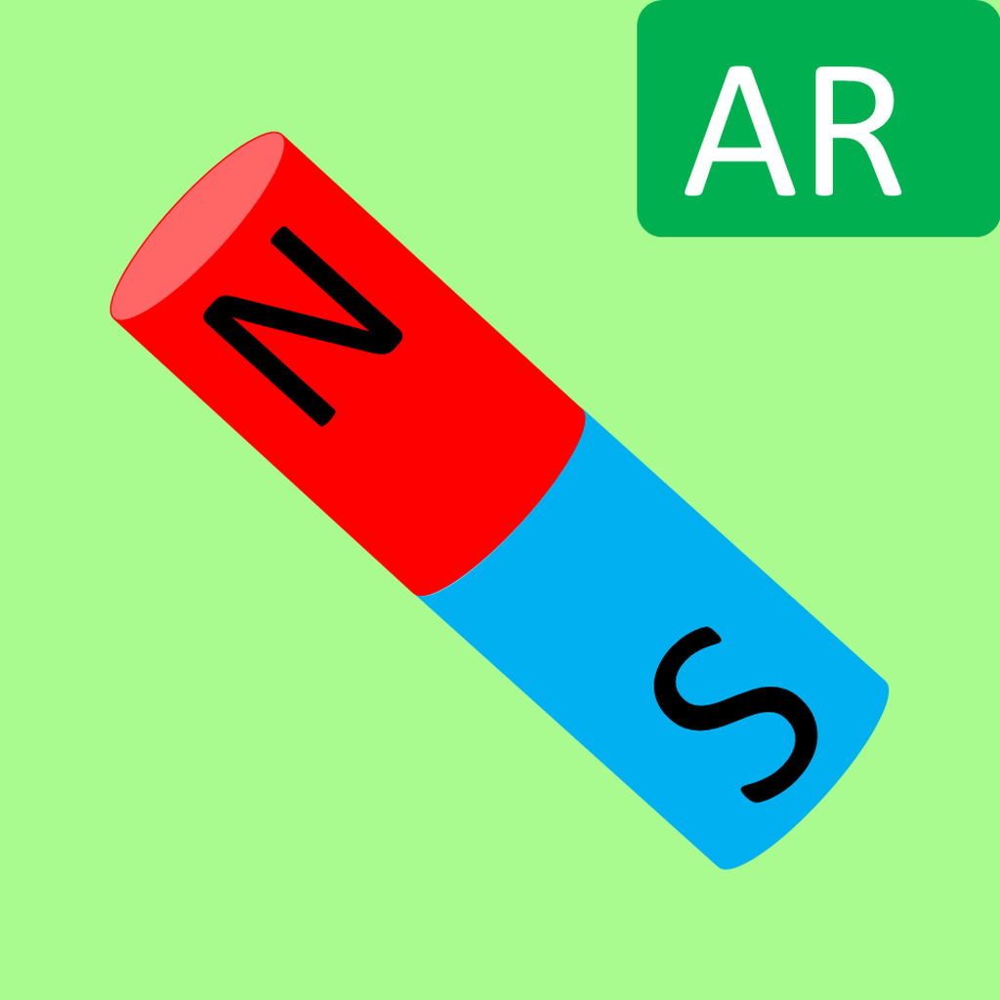

# MagneticAR -磁場を可視化するARアプリ

  

  iPhoneのセンサーとARを使い，目に見えない磁力線をリアルタイムで描画します.

    
    

---

## Features

* **ARによる磁場の3D可視化**: カメラをかざした空間に，磁力線を立体的に表示します．
* **リアルタイムのセンサーデータ反映**: 磁気センサーの値をリアルタイムに取得し，表示に反映します．
* **シンプルなUI**: 直感的な操作で誰でも簡単に使えます．

---

## Tech Stack

* **OS**: iOS 17.0+
* **言語**: Swift 5.9
* **フレームワーク**: ARKit, SwiftUI, Core Location
* **開発環境**: Xcode 15

---

## Requirements

* Mac (macOS Sonoma以上)
* Xcode 15以上
* iPhoneまたはiPad (iOS 17以上)

## Usage

1.  アプリを起動し，カメラへのアクセスを許可します．
2.  周囲の空間にカメラをかざしボタンを押すと，自動的に磁力線の描画が開始されます．
3.  画面内カメラボタンでスクリーンショットを撮影できます．

---
2025.07.19 Shunsuke Taira
